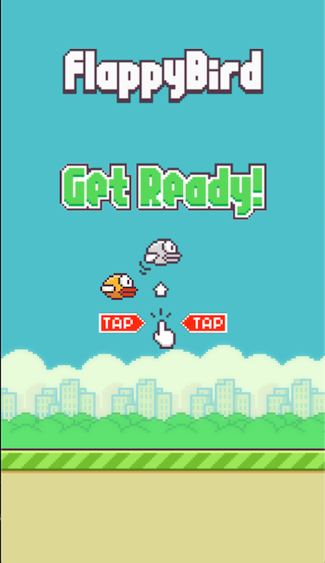

# Flappy Bird

An implementation of [Flappy Bird](https://en.wikipedia.org/wiki/Flappy_Bird) game written using [LÖVE](https://love2d.org/) in [Lua](https://www.lua.org/)

[Play it here :video_game:](https://shouryaps.com/flappy-bird/)

Assets sources:
1. [Pipe Sprite](http://cs.roanoke.edu/Fall2017/CPSC120B/lab23.html)
2. [Other Assets](https://github.com/samuelcust/flappy-bird-assets)